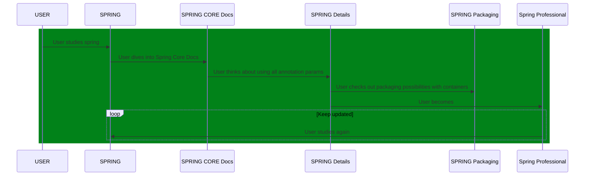

# Spring Master 5 Test Drives

[](https://twitter.com/intent/tweet?text=%20Checkout%20this%20%40github%20repo%20by%20%40joaofse%20%F0%9F%91%A8%F0%9F%8F%BD%E2%80%8D%F0%9F%92%BB%3A%20https%3A//github.com/jesperancinha/jeorg-spring-master-5-test-drives)
[](https://github.com/jesperancinha/jeorg-spring-master-5-test-drives)
[](#)
[](https://www.apache.org/licenses/LICENSE-2.0)

[](https://circleci.com/gh/jesperancinha/jeorg-spring-master-5-test-drives)
[](https://travis-ci.com/jesperancinha/jeorg-spring-master-5-test-drives)
[](https://ci.appveyor.com/project/jesperancinha/jeorg-spring-master-5-test-drives)
[](https://github.com/jesperancinha/jeorg-spring-master-5-test-drives/actions/workflows/jeorg-spring-master-5-test-drives.yml)

[](https://www.codacy.com/gh/jesperancinha/jeorg-spring-master-5-test-drives/dashboard?utm_source=github.com&amp;utm_medium=referral&amp;utm_content=jesperancinha/jeorg-spring-master-5-test-drives&amp;utm_campaign=Badge_Grade)
[](https://codebeat.co/projects/github-com-jesperancinha-jeorg-spring-master-5-test-drives-main)
[](https://bettercodehub.com/results/jesperancinha/jeorg-spring-master-5-test-drives)
[](https://snyk.io/test/github/jesperancinha/jeorg-spring-master-5-test-drives)

[](https://www.codacy.com/gh/jesperancinha/jeorg-spring-master-5-test-drives/dashboard?utm_source=github.com&utm_medium=referral&utm_content=jesperancinha/jeorg-spring-master-5-test-drives&utm_campaign=Badge_Coverage)
[](https://coveralls.io/github/jesperancinha/jeorg-spring-master-5-test-drives?branch=master)
[](https://codecov.io/gh/jesperancinha/your-finance-je)

[](#)
[](#)
[](#)

---

## Technologies used

---

[](https://www.oracle.com/nl/java/)
[](https://projectlombok.org/)
[](https://kotlinlang.org/)
[](https://spring.io/projects/spring-framework)
[](https://spring.io/projects/spring-boot)
[](https://spring.io/projects/spring-boot)
[](https://spring.io/reactive)
[](https://www.eclipse.org/jetty/)
[](http://tomcat.apache.org/)
[](https://site.mockito.org/)
[](https://assertj.github.io/doc/)

---

## Introduction

Welcome [JEOrg Spring Master 5 Test Drives](https://github.com/jesperancinha/jeorg-spring-master-5-test-drives).   
In these series we will only have master projects.   
We won't be looking at the basics so Spring 5. That will still occur in my other repo: [JEOrg Spring 5 Test Drives](https://github.com/jesperancinha/jeorg-spring-5-test-drives).

The setting in this repo is essentially about details.   
So for example is we are looking at a `@Transactional` annotation, we won't just be looking at what a `@Transactional` does.   
Further, we will be looking at what each single parameter of `@Transactional` actually does.

Please use this repo for your studies only if you alread have enough baggage from the Spring Framework.
We will avoid paying attention to basic Spring concepts.

Please have a look at our page where description of in-depth subjects are investigated and resources are provided [Technology](./Technology.md).

João Esperancinha 2021/05/22

## Build

Note that if you want to build this project from the root, you need to use one of the JDK 11 or upper versions.

<i>See [Hints&Tricks](https://github.com/jesperancinha/project-signer/blob/master/project-signer-templates/Hints%26Tricks.md)
document for more details</i>

Running on Travis.

```bash
mvn clean install -Dconsolerizer.show=false
```

## Install JDK 11 using [SDK-MAN](https://sdkman.io/)

```bash
sdk install java 11.0.9.hs-adpt
sdk use java 11.0.9.hs-adpt
```

## Run Codecov

```bash
mvn clean test -Dconsolerizer.show=false
bash <(curl -s https://codecov.io/bash)
```

## Sequence Diagram



<i>Note: You need a Mermaid plugin extension</i>

i.e. [mermaid-plugin](https://chrome.google.com/webstore/detail/mermaid-diagrams/phfcghedmopjadpojhmmaffjmfiakfil/related)

## Tech-stack Cloud

`@Transational timeout`, `TestRestTemplate`, `HealthIndicator`, `actuator`, `Embedded`, `JPA`, `Big Data`
`Cassandra support`, `Transaction under Transaction`, `Health indicators`, `packaging`
`containers`, `tomcat`, `jetty`

## References

### Books

-   Cosmina, I. (11th December 2019). <i>Pivotal Certified Professional Core Spring 5 Developer Exam: A Study Guide Using Spring Framework 5</i>. (Second Edition). Apress
-   Sharma, R. (September 2018). <i>Hands-On Reactive Programming with Reactor</i>. (First Edition). Packt
-   Cosmina, I. Harrop, R. Schaefer, C. Ho, C. (October 2017). <i>Pro Spring 5 An In-Depth Guide to the Spring Framework and Its Tools</i>. (Fifth Edition). Apress
-   Winch, R. Mularien, P. (December 2012). <i>Spring Security 3.1</i>. (Second Edition). Packt Publishing
-   Kurniawan, B. Deck, P. (January 2015). <i>Servlet, JSP & Spring MVC</i>. (First Edition). Brainy Software
-   Long, J. (2020). <i>Reactive Spring</i>. (First Edition). Josh Long

### Online

-   [What’s new in Spring Framework 5](https://developer.ibm.com/languages/java/tutorials/j-whats-new-in-spring-framework-5-theedom)
-   [Spring Framework Overview](https://docs.spring.io/spring-framework/docs/5.1.18.RELEASE/spring-framework-reference/overview.html)
-   [Spring Framework Documentation - Current Version](https://docs.spring.io/spring-framework/docs/current/reference/html/index.html)
