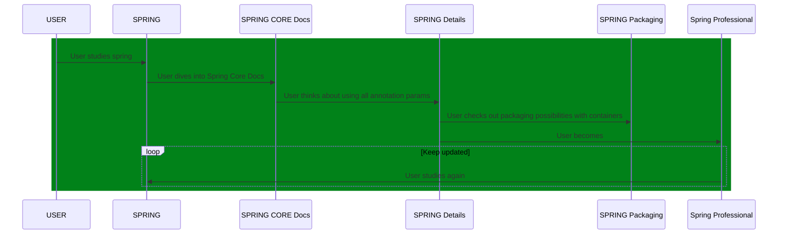

# Spring Master 5 Test Drives - Planets

## Introduction

Using Planets and their different names, distances and compositions, we'll see in this app how to work through important Spring topics.

## 1 - Container, Dependency and IoC

1. https://springframework.guru/best-practices-for-dependency-injection-with-spring/

We can have different servlet containers package into on single [Spring Boot War](https://spring.io/guides/gs/convert-jar-to-war/) file. Tomcat has precedence. If we don't remove it from [spring-boot-starter-web](https://mvnrepository.com/artifact/org.springframework.boot/spring-boot-starter-web), we will never see Jetty or Undertow in action. In our package we are using these three servlet container, but only tomcat is activated:

```xml   
<dependency>
	<groupId>org.springframework.boot</groupId>
	<artifactId>spring-boot-starter-web</artifactId>
</dependency>
<dependency>
	<groupId>org.springframework.boot</groupId>
	<artifactId>spring-boot-starter-jetty</artifactId>
</dependency>
<dependency>
	<groupId>org.springframework.boot</groupId>
	<artifactId>spring-boot-starter-undertow</artifactId>
</dependency>
```

## 2 - AOP

## 3 - Transactions

## 4 - JPA

## 5 - MVC Basics

## 6 - MVC REST

## 7 - Security

## 8 - Testing

## 9 - Spring Boot Basics

## 10 - Spring Boot Auto-Configuration

We can use the [ConfigurationProperties](https://docs.spring.io/spring-boot/docs/current/api/org/springframework/boot/context/properties/ConfigurationProperties.html) annotation, to specify a group of configuration parameters from the configuration file.
In our smtd.earth field group, we have habitable which I explicitly did not declare in the class in order to show what would happen should we use property `ignoreInvalidFields` to `false`, which is its default value:

```text   
***************************
APPLICATION FAILED TO START
***************************

Description:

Binding to target [Bindable@e8e0dec type = org.jesperancinha.smtd.planets.configuration.PlanetConfiguration$$EnhancerBySpringCGLIB$$4463d7b5, value = 'provided', annotations = array<Annotation>[@org.springframework.boot.context.properties.ConfigurationProperties(ignoreInvalidFields=false, ignoreUnknownFields=false, prefix=smtd.earth, value=smtd.earth)]] failed:

    Property: smtd.earth.habitable
    Value: true
    Origin: class path resource [application.properties]:5:22
    Reason: The elements [smtd.earth.habitable] were left unbound.

Action:

Update your application's configuration
```

Finally we can see

## 11 - Spring Boot Actuator

## 12 - Spring Boot Testing

---

[](https://twitter.com/intent/tweet?text=%20Checkout%20this%20%40github%20repo%20by%20%40joaofse%20%F0%9F%91%A8%F0%9F%8F%BD%E2%80%8D%F0%9F%92%BB%3A%20https%3A//github.com/jesperancinha/jeorg-spring-master-5-test-drives)
[](https://github.com/jesperancinha/jeorg-spring-master-5-test-drives)
[](#)
[](https://www.apache.org/licenses/LICENSE-2.0)

[](https://circleci.com/gh/jesperancinha/jeorg-spring-master-5-test-drives)
[](https://travis-ci.com/jesperancinha/jeorg-spring-master-5-test-drives)
[](https://ci.appveyor.com/project/jesperancinha/jeorg-spring-master-5-test-drives)
[](https://github.com/jesperancinha/jeorg-spring-master-5-test-drives/actions/workflows/jeorg-spring-master-5-test-drives.yml)

[](https://www.codacy.com/gh/jesperancinha/jeorg-spring-master-5-test-drives/dashboard?utm_source=github.com&amp;utm_medium=referral&amp;utm_content=jesperancinha/jeorg-spring-master-5-test-drives&amp;utm_campaign=Badge_Grade)
[](https://codebeat.co/projects/github-com-jesperancinha-jeorg-spring-master-5-test-drives-main)
[](https://bettercodehub.com/results/jesperancinha/jeorg-spring-master-5-test-drives)
[](https://snyk.io/test/github/jesperancinha/jeorg-spring-master-5-test-drives)

[](https://www.codacy.com/gh/jesperancinha/jeorg-spring-master-5-test-drives/dashboard?utm_source=github.com&utm_medium=referral&utm_content=jesperancinha/jeorg-spring-master-5-test-drives&utm_campaign=Badge_Coverage)
[](https://coveralls.io/github/jesperancinha/jeorg-spring-master-5-test-drives?branch=master)
[](https://codecov.io/gh/jesperancinha/jeorg-spring-master-5-test-drives)

[](#)
[](#)
[](#)

---

## Technologies used

---

[](https://www.oracle.com/nl/java/)
[](https://projectlombok.org/)
[](https://kotlinlang.org/)
[](https://spring.io/projects/spring-framework)
[](https://spring.io/projects/spring-boot)
[](https://spring.io/projects/spring-boot)
[](https://spring.io/reactive)
[](https://www.eclipse.org/jetty/)
[](http://tomcat.apache.org/)
[](https://undertow.io/)
[](https://site.mockito.org/)
[](https://assertj.github.io/doc/)
[](https://www.docker.com/)
[](https://docs.docker.com/compose/)
[](https://www.h2database.com/)
[](https://www.postgresql.org/)
[](http://cassandra.apache.org/)

---

## Introduction

Welcome to [JEOrg Spring Master 5 Test Drives](https://github.com/jesperancinha/jeorg-spring-master-5-test-drives).   
In these series we will only have master projects available. We won't be looking at the basics of Spring 5.   
That will still occur in my other repo: [JEOrg Spring 5 Test Drives](https://github.com/jesperancinha/jeorg-spring-5-test-drives).

The setting in this repo is essentially about details.   
So for example if we are looking at a `@Transactional` annotation, we won't just be looking at what a `@Transactional` does.   
Further, we will be looking at what each single parameter of `@Transactional` actually does.

Please use this repo for your studies only if you already have enough baggage from the Spring Framework. We will avoid paying attention to basic Spring concepts.

Please have a look at our page where the description of the in-depth subjects investigated and related web resources are provided: [Technology](./Technology.md).

Also, please check our [Reminders](./reminders/Reminders.md) page, where short descriptions are presented in a flash card fashion for specific theoretical aspects of the Spring Framework.

We all know, in a way, what Spring Boot is, but sometimes it is very important to explain what it actually is. Find more in our [Spring Boot](./reminders/SpringBoot.md) section.

João Esperancinha 2021/05/22

## Build

Note that if you want to build this project from the root, you need to use one of the JDK 11 or upper versions.

<i>See [Hints&Tricks](https://github.com/jesperancinha/project-signer/blob/master/project-signer-templates/Hints%26Tricks.md)
document for more details</i>

Running on Travis.

```bash
mvn clean install -Dconsolerizer.show=false
```

## Install JDK 11 using [SDK-MAN](https://sdkman.io/)

```bash
sdk install java 11.0.9.hs-adpt
sdk use java 11.0.9.hs-adpt
```

## Run Codecov

```bash
mvn clean test -Dconsolerizer.show=false
bash <(curl -s https://codecov.io/bash)
```

## Sequence Diagram



<i>Note: You need a Mermaid plugin extension</i>

i.e. [mermaid-plugin](https://chrome.google.com/webstore/detail/mermaid-diagrams/phfcghedmopjadpojhmmaffjmfiakfil/related)

## Tech-stack Cloud

`@Transational timeout`, `TestRestTemplate`, `HealthIndicator`, `actuator`, `Embedded`, `JPA`, `Big Data`
`Cassandra support`, `Transaction under Transaction`, `Health indicators`, `packaging`
`containers`, `tomcat`, `jetty`

## References

### Books

-   Cosmina, I. (11th December 2019). <i>Pivotal Certified Professional Core Spring 5 Developer Exam: A Study Guide Using Spring Framework 5</i>. (Second Edition). Apress
-   Sharma, R. (September 2018). <i>Hands-On Reactive Programming with Reactor</i>. (First Edition). Packt
-   Cosmina, I. Harrop, R. Schaefer, C. Ho, C. (October 2017). <i>Pro Spring 5 An In-Depth Guide to the Spring Framework and Its Tools</i>. (Fifth Edition). Apress
-   Winch, R. Mularien, P. (December 2012). <i>Spring Security 3.1</i>. (Second Edition). Packt Publishing
-   Kurniawan, B. Deck, P. (January 2015). <i>Servlet, JSP & Spring MVC</i>. (First Edition). Brainy Software
-   Long, J. (2020). <i>Reactive Spring</i>. (First Edition). Josh Long

### Online

-   [Spring Data Cassandra](https://docs.spring.io/spring-data/cassandra/docs/current/reference/html/#preface)
-   [Spring Boot Actuator Web API Documentation](https://docs.spring.io/spring-boot/docs/current/actuator-api/htmlsingle/)
-   [Spring Boot Reference Documentation](https://docs.spring.io/spring-boot/docs/current/reference/html/)
-   [What’s new in Spring Framework 5](https://developer.ibm.com/languages/java/tutorials/j-whats-new-in-spring-framework-5-theedom)
-   [Spring Framework Overview](https://docs.spring.io/spring-framework/docs/5.1.18.RELEASE/spring-framework-reference/overview.html)
-   [Spring Framework Documentation - Current Version](https://docs.spring.io/spring-framework/docs/current/reference/html/index.html)

## About me 👨🏽‍💻🚀🏳️‍🌈

[](http://joaofilipesabinoesperancinha.nl)
[](https://medium.com/@jofisaes)
[](https://www.credly.com/users/joao-esperancinha)
[](https://joaofilipesabinoesperancinha.nl/)
[](https://github.com/jesperancinha)
[](https://twitter.com/joaofse)
[](https://github.com/JEsperancinhaOrg)   
[](https://github.com/jesperancinha/project-signer/blob/master/project-signer-templates/Articles.md)
[](http://itf.joaofilipesabinoesperancinha.nl/)
[](https://joaofilipesabinoesperancinha.nl/badges)
[](https://github.com/jesperancinha/project-signer/blob/master/project-signer-quality/Build.md)
[](https://www.coursera.org/user/da3ff90299fa9297e283ee8e65364ffb)
[](https://play.google.com/store/apps/developer?id=Joao+Filipe+Sabino+Esperancinha)   
[](https://search.maven.org/search?q=org.jesperancinha)
[](https://hub.docker.com/u/jesperancinha)
[](https://stackoverflow.com/users/3702839/joao-esperancinha)
[](https://www.reddit.com/user/jesperancinha/)
[](https://dev.to/jofisaes)
[](https://hackernoon.com/@jesperancinha)
[](https://www.codeproject.com/Members/jesperancinha)
[](https://github.com/jesperancinha)
[](https://bitbucket.org/jesperancinha)
[](https://gitlab.com/jesperancinha)
[](https://bintray.com/jesperancinha)
[](https://www.freecodecamp.org/jofisaes)
[](https://www.hackerrank.com/jofisaes)
[](https://codeforces.com/profile/jesperancinha)
[](https://coderbyte.com/profile/jesperancinha)
[](https://www.codewars.com/users/jesperancinha)
[](https://codepen.io/jesperancinha)
[](https://news.ycombinator.com/user?id=jesperancinha)
[](https://www.infoq.com/profile/Joao-Esperancinha.2/)
[](https://www.linkedin.com/in/joaoesperancinha/)
[](https://www.xing.com/profile/Joao_Esperancinha/cv)
[](https://jofisaes.tumblr.com/)
[](https://nl.pinterest.com/jesperancinha/)
[](https://nl.quora.com/profile/Jo%C3%A3o-Esperancinha)

## Achievements

[](https://www.credly.com/badges/27a14e06-f591-4105-91ca-8c3215ef39a2)
[](https://www.credly.com/badges/87609d8e-27c5-45c9-9e42-60a5e9283280)
[](https://www.credly.com/badges/92e036f5-4e11-4cff-9935-3e62266d2074)
[](https://www.credly.com/badges/a206436d-6fd8-4ca1-8feb-38a838446ee7)
[](https://www.credly.com/badges/f4c6cc1e-cb52-432b-904d-36d266112225)
[](https://www.credly.com/badges/6db92c1e-7bca-4856-9543-0d5ed0182794)
