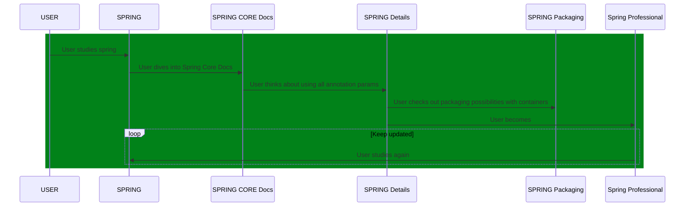

# Spring Master Test Drives - The Vault ☢️

## Introduction

In the Vault we test security

Users available are:

1.  keeper_role/keeper_role - Logs in with role `ROLE_KEEPER`
2.  keeper_auth/keeper_auth - Logs in with authority `KEEPER`

In this exercise we check how security works and how matches work in the authorities resolution

Let's consider url http://127.0.0.1:8081/vault/silver/test. In our case `keeper_role` would possibly match:

```kotlin
?.mvcMatchers(HttpMethod.GET, "/vault/silver/**")?.hasRole("KEEPER")
```

However, this doesn't happen, because the first matcher also matches the url:

```kotlin
?.mvcMatchers(HttpMethod.GET, "/vault/silver/**")?.hasAuthority("KEEPER")
```

This also means that the last matcher would also never be reached:

```kotlin
?.mvcMatchers(HttpMethod.GET, "/vault/silver/test")?.permitAll()
```

For this url, all three matchers are valid, but in this case Spring Security picks the first one.
That ones says that only a user with authority `KEEPER` is allowed to login. This will be user `keeper_auth`.

### Endpoints

1.  http://127.0.0.1:8081/vault/silver/test

## 1 - Container, Dependency and IoC

1.  https://springframework.guru/best-practices-for-dependency-injection-with-spring/
2.  https://dzone.com/articles/spring-bean-lifecycle
3.  https://stackoverflow.com/questions/39890849/what-exactly-is-field-injection-and-how-to-avoid-it
4.  https://howtodoinjava.com/spring-core/spring-bean-life-cycle/
5.  https://docs.spring.io/spring-framework/docs/3.0.x/reference/expressions.html
6.  https://docs.spring.io/spring-integration/docs/current/reference/html/spel.html#spel
7.  https://www.dev2qa.com/spring-expression-language-example-vs/
8.  https://dzone.com/articles/beginners-guide-to-spring-expression-language-with
9.  https://docs.spring.io/spring-framework/docs/current/javadoc-api/org/springframework/core/annotation/Order.html
10. https://docs.spring.io/spring-framework/docs/current/javadoc-api/org/springframework/context/annotation/Lazy.html
11. https://docs.spring.io/spring-framework/docs/current/javadoc-api/org/springframework/context/annotation/Import.html
12. https://docs.spring.io/spring-framework/docs/current/javadoc-api/org/springframework/context/annotation/DependsOn.html
13. https://docs.spring.io/spring-boot/docs/current/reference/html/howto.html#howto.application.failure-analyzer
14. https://docs.spring.io/spring-boot/docs/current/reference/html/howto.html#howto.application.customize-the-environment-or-application-context
15. https://zetcode.com/springboot/applicationcontext/
16. https://zetcode.com/springboot/profile/
17. https://docs.spring.io/spring-boot/docs/1.2.0.M1/reference/html/boot-features-profiles.html
18. https://www.amitph.com/how-to-use-spring-profiles/
19. https://springframework.guru/spring-profiles/
20. https://devs4j.com/2017/10/30/support-multiple-profiles-with-spring-boot/
21. https://docs.spring.io/spring-boot/docs/current/reference/html/features.html#features.profiles
22. https://sookocheff.com/post/java/understanding-springs-environment-abstraction/

## 2 - AOP

1.  https://docs.spring.io/spring-framework/docs/current/reference/html/core.html#beans-factory-scopes-other-injection-proxies
2.  https://docs.spring.io/spring-framework/docs/current/reference/html/core.html#aop-proxying
3.  https://stackoverflow.com/questions/22861587/why-protected-methods-are-not-intercepted-by-spring-aop#:~:text=Due%20to%20the%20proxy%2Dbased,not%20recommendable%20for%20AOP%20purposes).
4.  https://stackoverflow.com/questions/51795511/when-is-cglib-proxy-used-by-spring-aop
5.  https://howtodoinjava.com/spring-aop/aspectj-pointcut-expressions/

## 3 - Transactions

1.  https://docs.spring.io/spring-framework/docs/current/javadoc-api/org/springframework/transaction/annotation/Transactional.html
2.  https://docs.spring.io/spring-framework/docs/current/javadoc-api/org/springframework/transaction/annotation/Propagation.html
3.  https://docs.spring.io/spring-framework/docs/4.2.x/spring-framework-reference/html/transaction.html
4.  https://docs.spring.io/spring-framework/docs/current/javadoc-api/org/springframework/transaction/support/TransactionTemplate.html

In a transaction, the `readOnly`, only means possible performance improvements.

Calling private methods withing a class TODO:

## 4 - JPA

1.  https://reflectoring.io/spring-boot-data-jpa-test/
2.  https://zetcode.com/springboot/datajpatest/
3.  https://www.arhohuttunen.com/spring-boot-datajpatest/
4.  https://bezkoder.com/spring-boot-unit-test-jpa-repo-datajpatest/
5.  https://howtodoinjava.com/spring-boot2/testing/datajpatest-annotation/
6.  https://www.javaguides.net/2018/09/spring-data-jpa-repository-testing-using-spring-boot-datajpatest.html
7.  https://howtodoinjava.com/spring-boot2/datasource-configuration/
8.  https://docs.spring.io/spring-data/jpa/docs/current/reference/html/#jpa.query-methods.at-query
			
## 5 - MVC Basics

1.  https://docs.spring.io/spring-framework/docs/current/reference/html/web.html#mvc-ann-arguments

## 6 - MVC REST

1.  https://spring.io/guides/gs/serving-web-content/

## 7 - Security

1.  https://dzone.com/articles/what-does-spring-delegatingfilterproxy-do
2.  https://docs.spring.io/spring-framework/docs/current/javadoc-api/org/springframework/web/filter/DelegatingFilterProxy.html
3.  https://stackoverflow.com/questions/6725234/whats-the-point-of-spring-mvcs-delegatingfilterproxy
4.  https://springbootdev.com/2017/09/09/spring-security-delegatingfilterproxy/
5.  https://www.youtube.com/watch?v=lxmBJmUhqss
6.  https://www.youtube.com/watch?v=xEnvAAhMGu4
7.  https://github.com/jzheaux/springone2019
8.  https://github.com/jzheaux/springone2020
9.  https://www.youtube.com/watch?v=TDuVY8PFU3Q
10. https://docs.spring.io/spring-security/site/docs/4.2.20.RELEASE/apidocs/org/springframework/security/core/context/SecurityContextHolder.html
11. https://programmersought.com/article/63182958726/
12. https://javarevisited.blogspot.com/2018/02/what-is-securitycontext-and-SecurityContextHolder-Spring-security.html#axzz6w2sHEiVK
13. https://docs.spring.io/spring-security/site/docs/3.0.x/reference/technical-overview.html
14. https://www.mfvitale.me/blog/2021/02/24/security.context.and.concurrency.html
15. https://dzone.com/articles/how-to-get-current-logged-in-username-in-spring-se
16. https://dzone.com/articles/what-does-spring-delegatingfilterproxy-do
17. https://dzone.com/articles/how-to-get-current-logged-in-username-in-spring-se#:~:text=The%20SecurityContext%20is%20used%20to,access%20to%20the%20security%20context.
				
## 8 - Testing

1.  https://docs.spring.io/spring-framework/docs/4.3.12.RELEASE/spring-framework-reference/html/unit-testing.html
2.  https://docs.spring.io/spring-framework/docs/current/reference/html/testing.html
3.  https://www.concretepage.com/spring-5/webappconfiguration-example-spring-test
4.  https://docs.spring.io/spring-framework/docs/current/reference/html/testing.html
5.  https://docs.spring.io/spring-boot/docs/current/reference/html/features.html#features.testing
6.  https://examples.javacodegeeks.com/enterprise-java/spring/using-mockrestserviceserver-test-rest-client/
7.  https://stackoverflow.com/questions/43653655/what-is-difference-between-importautoconfiguration-and-import
8.  https://www.concretepage.com/spring-5/dirtiescontext-example-spring-test
9.  https://docs.spring.io/spring-framework/docs/current/reference/html/testing.html#integration-testing-annotations-spring
10. https://docs.spring.io/spring-framework/docs/current/javadoc-api/org/springframework/test/context/ContextConfiguration.html
## 9 - Spring Boot Basics

1.  https://springframework.guru/spring-external-configuration-data/
2.  https://mkyong.com/spring/spring-propertysources-example/
3.  http://www.dailycodebuffer.com/shutdown-a-spring-boot-application/#:~:text=Close%20ApplicationContext,method%20to%20close%20ApplicationContext%20programmatically.

## 10 - Spring Boot Auto-Configuration

1.  https://docs.spring.io/spring-boot/docs/current/reference/htmlsingle/#features.developing-auto-configuration
2.  https://docs.spring.io/spring-boot/docs/2.3.4.RELEASE/reference/htmlsingle/#boot-features-external-config
3.  https://docs.spring.io/spring-boot/docs/current/reference/htmlsingle/#boot-features-spring-mvc-auto-configuration

## 11 - Spring Boot Actuator

1.  https://dzone.com/articles/maven-git-commit-id-plugin
2.  https://codeboje.de/spring-boot-info-actuator/
3.  https://docs.spring.io/spring-boot/docs/current/reference/htmlsingle/#actuator.endpoints.exposing
4.  https://www.logicbig.com/tutorials/spring-framework/spring-boot/accessing-jmx-actuator-endpoints.html
5.  https://docs.spring.io/spring-boot/docs/current/reference/html/actuator.html#actuator.jmx

## 12 - Spring Boot Testing

1.  https://howtodoinjava.com/spring-boot2/testing/springboot-test-configuration/
2.  https://docs.spring.io/spring-framework/docs/current/javadoc-api/org/springframework/context/annotation/Lazy.html
3.  https://docs.spring.io/spring-framework/docs/current/javadoc-api/org/springframework/jdbc/datasource/embedded/EmbeddedDatabaseBuilder.html

---

[](https://twitter.com/intent/tweet?text=%20Checkout%20this%20%40github%20repo%20by%20%40joaofse%20%F0%9F%91%A8%F0%9F%8F%BD%E2%80%8D%F0%9F%92%BB%3A%20https%3A//github.com/jesperancinha/jeorg-spring-master-test-drives)
[](https://github.com/jesperancinha/jeorg-spring-master-test-drives)
[](#)
[](https://www.apache.org/licenses/LICENSE-2.0)

[](https://circleci.com/gh/jesperancinha/jeorg-spring-master-test-drives)
[](https://ci.appveyor.com/project/jesperancinha/jeorg-spring-master-test-drives)
[](https://github.com/jesperancinha/jeorg-spring-master-test-drives/actions/workflows/jeorg-spring-master-test-drives.yml)

[](https://www.codacy.com/gh/jesperancinha/jeorg-spring-master-test-drives/dashboard?utm_source=github.com&amp;utm_medium=referral&amp;utm_content=jesperancinha/jeorg-spring-master-test-drives&amp;utm_campaign=Badge_Grade)
[](https://codebeat.co/projects/github-com-jesperancinha-jeorg-spring-master-test-drives-main)
[](https://bettercodehub.com/results/jesperancinha/jeorg-spring-master-test-drives)
[](https://snyk.io/test/github/jesperancinha/jeorg-spring-master-5-test-drives)

[](https://www.codacy.com/gh/jesperancinha/jeorg-spring-master-5-test-drives/dashboard?utm_source=github.com&utm_medium=referral&utm_content=jesperancinha/jeorg-spring-master-5-test-drives&utm_campaign=Badge_Coverage)
[](https://coveralls.io/github/jesperancinha/jeorg-spring-master-5-test-drives?branch=master)
[](https://codecov.io/gh/jesperancinha/jeorg-spring-master-5-test-drives)

[](#)
[](#)
[](#)

---

## Technologies used

Please check the [TechStack.md](TechStack.md) file for details.

## Introduction

Welcome to [JEOrg Spring Master Test Drives](https://github.com/jesperancinha/jeorg-spring-master-5-test-drives).   
In these series we will only have master projects available. We won't be looking at the basics of Spring 5.   
That will still occur in my other repo: [JEOrg Spring 5 Test Drives](https://github.com/jesperancinha/jeorg-spring-5-test-drives).

The setting in this repo is essentially about details.   
So for example if we are looking at a `@Transactional` annotation, we won't just be looking at what a `@Transactional` does.   
Further, we will be looking at what each single parameter of `@Transactional` actually does.

Please use this repo for your studies only if you already have enough baggage from the Spring Framework. We will avoid paying attention to basic Spring concepts.

Please have a look at our page where the description of the in-depth subjects investigated and related web resources are provided: [Technology](./Technology.md).

Also, please check our [Reminders](./reminders/Reminders.md) page, where short descriptions are presented in a flash card fashion for specific theoretical aspects of the Spring Framework.

We all know, in a way, what Spring Boot is, but sometimes it is very important to explain what it actually is. Find more in our [Spring Boot](./reminders/SpringBoot.md) section.

João Esperancinha 2021/05/22

## Build

Note that if you want to build this project from the root, you need to use one of the JDK 11 or upper versions.

<i>See [Hints&Tricks](https://github.com/jesperancinha/project-signer/blob/master/project-signer-templates/Hints%26Tricks.md)
document for more details</i>
```bash
mvn clean install -Dconsolerizer.show=false
```

## Install JDK 11 using [SDK-MAN](https://sdkman.io/)

```bash
sdk install java 11.0.9.hs-adpt
sdk use java 11.0.9.hs-adpt
```

## Run Codecov

```bash
mvn clean test -Dconsolerizer.show=false
bash <(curl -s https://codecov.io/bash)
```

## Sequence Diagram



<i>Note: You need a Mermaid plugin extension</i>

i.e. [mermaid-plugin](https://chrome.google.com/webstore/detail/mermaid-diagrams/phfcghedmopjadpojhmmaffjmfiakfil/related)

## Tech-stack Cloud

`@Transational timeout`, `TestRestTemplate`, `HealthIndicator`, `actuator`, `Embedded`, `JPA`, `Big Data`
`Cassandra support`, `Transaction under Transaction`, `Health indicators`, `packaging`
`containers`, `tomcat`, `jetty`

## References

### Books

-   Cosmina, I. (11th December 2019). <i>Pivotal Certified Professional Core Spring 5 Developer Exam: A Study Guide Using Spring Framework 5</i>. (Second Edition). Apress
-   Sharma, R. (September 2018). <i>Hands-On Reactive Programming with Reactor</i>. (First Edition). Packt
-   Cosmina, I. Harrop, R. Schaefer, C. Ho, C. (October 2017). <i>Pro Spring 5 An In-Depth Guide to the Spring Framework and Its Tools</i>. (Fifth Edition). Apress
-   Winch, R. Mularien, P. (December 2012). <i>Spring Security 3.1</i>. (Second Edition). Packt Publishing
-   Kurniawan, B. Deck, P. (January 2015). <i>Servlet, JSP & Spring MVC</i>. (First Edition). Brainy Software
-   Long, J. (2020). <i>Reactive Spring</i>. (First Edition). Josh Long

### Online

-   [Spring Data Cassandra](https://docs.spring.io/spring-data/cassandra/docs/current/reference/html/#preface)
-   [Spring Boot Actuator Web API Documentation](https://docs.spring.io/spring-boot/docs/current/actuator-api/htmlsingle/)
-   [Spring Boot Reference Documentation](https://docs.spring.io/spring-boot/docs/current/reference/html/)
-   [What’s new in Spring Framework 5](https://developer.ibm.com/languages/java/tutorials/j-whats-new-in-spring-framework-5-theedom)
-   [Spring Framework Overview](https://docs.spring.io/spring-framework/docs/5.1.18.RELEASE/spring-framework-reference/overview.html)
-   [Spring Framework Documentation - Current Version](https://docs.spring.io/spring-framework/docs/current/reference/html/index.html)

## About me

<div align="center">

[](http://joaofilipesabinoesperancinha.nl)
[](https://www.youtube.com/@joaoesperancinha)
[](https://medium.com/@jofisaes)
[](https://www.buymeacoffee.com/jesperancinha)
[](https://twitter.com/joaofse)
[](https://masto.ai/@jesperancinha)
[](https://www.facebook.com/joaofisaes/)
[](https://sessionize.com/joao-esperancinha)
[](https://www.instagram.com/joaofisaes)
[](https://jofisaes.tumblr.com)
[](https://open.spotify.com/user/jlnozkcomrxgsaip7yvffpqqm)
[](https://www.linkedin.com/in/joaoesperancinha/)
[](https://www.xing.com/profile/Joao_Esperancinha/cv)
[](https://news.ycombinator.com/user?id=jesperancinha)
[](https://github.com/jesperancinha)
[](https://bitbucket.org/jesperancinha)
[](https://gitlab.com/jesperancinha)
[](https://central.sonatype.com/search?smo=true&q=org.jesperancinha)
[](https://stackoverflow.com/users/3702839/joao-esperancinha)
[](https://www.credly.com/users/joao-esperancinha)
[](https://www.coursera.org/user/da3ff90299fa9297e283ee8e65364ffb)
[](https://hub.docker.com/u/jesperancinha)
[](https://www.reddit.com/user/jesperancinha/)
[](https://hackernoon.com/@jesperancinha)
[](https://dev.to/jofisaes)
[](https://www.codeproject.com/Members/jesperancinha)
[](https://www.freecodecamp.org/jofisaes)
[](https://www.hackerrank.com/jofisaes)
[](https://leetcode.com/jofisaes)
[](https://www.codewars.com/users/jesperancinha)
[](https://codepen.io/jesperancinha)
[](https://www.hackerearth.com/@jofisaes)
[](https://www.khanacademy.org/profile/jofisaes)
[](https://nl.pinterest.com/jesperancinha)
[](https://nl.quora.com/profile/Jo%C3%A3o-Esperancinha)
[](https://play.google.com/store/apps/developer?id=Joao+Filipe+Sabino+Esperancinha)
[](https://coderbyte.com/profile/jesperancinha)
[](https://www.infoq.com/profile/Joao-Esperancinha.2/)
[](https://www.credly.com/badges/87609d8e-27c5-45c9-9e42-60a5e9283280)
[](https://www.credly.com/badges/27a14e06-f591-4105-91ca-8c3215ef39a2)
[](https://www.credly.com/badges/762fa7a4-9cf4-417d-bd29-7e072d74cdb7)
[](https://www.credly.com/badges/ad1f4abe-3dfa-4a8c-b3c7-bae4669ad8ce)
[](https://www.credly.com/badges/8d27e38c-869d-4815-8df3-13762c642d64)
[](https://graphacademy.neo4j.com/certificates/c279afd7c3988bd727f8b3acb44b87f7504f940aac952495ff827dbfcac024fb.pdf)
[](https://cancanit.com/certified/1462/)
[](https://konghq.com/kong-champions)
[](https://github.com/JEsperancinhaOrg)
[](https://joaofilipesabinoesperancinha.nl/badges)
[](https://github.com/jesperancinha/project-signer/blob/master/project-signer-quality/Build.md)

</div>
